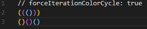

# FORXTU ☄️

[](https://marketplace.visualstudio.com/items?itemName=forxtu.forxtu-vscode-theme)
[](https://marketplace.visualstudio.com/items?itemName=forxtu.forxtu-vscode-theme)
[](https://marketplace.visualstudio.com/items?itemName=forxtu.forxtu-vscode-theme)
[](https://marketplace.visualstudio.com/items?itemName=forxtu.forxtu-vscode-theme)

A Visual Studio Code theme for the hardcore programmers out there. ✨

## FORXTU Theme


## FORXTU Light theme in progress

# Installation

1.  Install [Visual Studio Code](https://code.visualstudio.com/)
2.  Launch Visual Studio Code
3.  Choose **Extensions** from menu
4.  Search for `forxtu`
5.  Pick **FORXTU Theme** from list
6.  Click **Install** to install it
7.  Click **Reload** to reload the Code
8.  From the menu bar click: Code > Preferences > Color Theme > **FORXTU Theme**

## Preferences shown in the preview

The font in the preview image is Fira Code, [available here](https://github.com/tonsky/FiraCode). Editor settings to activate font ligatures:

```
"editor.fontFamily": "Fira Code",
"editor.fontLigatures": true,
```

The preview image is using [Bracket Pair Colorizer](https://marketplace.visualstudio.com/items?itemName=CoenraadS.bracket-pair-colorizer), a great extension that highlights matching brackets.

I use this setting:

```
"bracketPairColorizer.forceIterationColorCycle": true,
```



## Misc

This is my first attempt to create a theme, so if I missed something, please feel free to [file an issue](https://github.com/forxtu/forxtu-vscode-theme/issues)!

Any relevant changes for each version are documented in the changelog. Please update and check the changelog before filing any issues, as they may have already been taken care of.

This theme was inspired by [this](https://css-tricks.com/creating-a-vs-code-theme/) article and Night owl [Theme](https://marketplace.visualstudio.com/items?itemName=sdras.night-owl)
